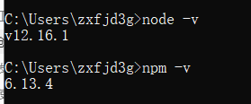
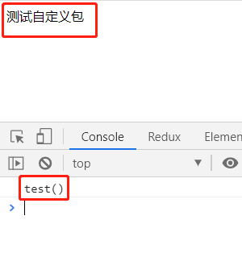

# 2.创建工具包项目

## 2.1.安装Node

- 检查是否已经安装node(node中自带npm)



- 如果node与npm命令不识别,说明你还没有安装node
- 安装node, 这里我就不带大家一步一步安装了(比较简单)
  - 方案一: 下载尚硅谷node的视频教程来学习安装
  - 方案二: 百度查找node的安装教程

## 2.2.创建项目

```bash
# 创建一个空的项目文件夹: atguigu-utils
# 在文件夹下执行命令
npm init -y
```

## 2.3.下载依赖包

```shell
npm i webpack webpack-cli
```

## 2.4.配置webpack

- `webpack.config.js`

```js
const path = require('path')
module.exports = {
  // 模式
  mode: 'development', // 也可以使用 production
  // 入口
  entry: './src/index.js', 
  // 出口
  output: {
    // 打包文件夹
    path: path.resolve(__dirname, 'dist'),
    // 打包文件
    filename: 'atguigu-utils.js', 
    // 向外暴露的对象的名称
    library: 'aUtils',
    // 打包生成库可以通过esm/commonjs/reqirejs的语法引入
    libraryTarget: 'umd', 
  },
}
```

## 2.5.在入口JS中暴露功能

- `src/index.js`

```js
export function test() {
  document.write('测试自定义包')
  console.log('test()')
}
```

## 2.6.配置打包命令

- `package.json`

```json
"scripts": {
  "build:watch": "webpack --watch"
},
```


## 2.7.对项目进行打包

```bash
npm run build:watch
```

## 2.8.测试使用自定义包

- `test/first.html`

```html
<body>
  <script src="../dist/atguigu-utils.js"></script>
  <script>
    aUtils.test()
  </script>
</body>
```

