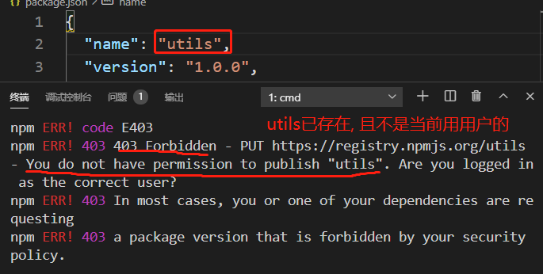
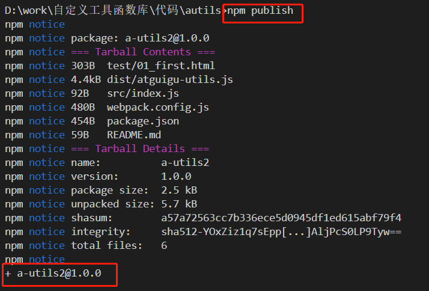

# 3.发布到npm仓库

## 3.1.完善 package.json

- 注意:
  - name: 必须是唯一的名称(在npm在线中央仓库中没有同名的)
  - main: 必须指定为打包生成的js文件
  - keywords: 指定一些方便别的程序员搜索到当前库的关键字

```json
{
  "name": "utils",
  "version": "1.0.0",
  "author": "xfzhang",
  "description": "尚硅谷-前端-自定义工具函数库",
  "keywords": [
    "atguigu",
    "utils",
    "array",
    "object",
    "function",
    "string",
    "axios",
    "event-bus",
    "pub-sub",
    "promise"
  ],
  "main": "dist/atguigu-utils.js",
  "license": "MIT",
  "scripts": {
    "build": "webpack --watch"
  },
  "devDependencies": {
    "webpack": "^5.9.0",
    "webpack-cli": "^4.2.0"
  }
}
```


## 3.2.npm配置

- npm配置的中央仓库不能是淘宝镜像
- 发布前必须执行:  npm config set registry https://registry.npmjs.org/
- 不用发布时: npm config set registry http://registry.npm.taobao.org/
- 查看配置: npm config list

## 3.3.注册npm中央仓库账号

- 注册地址: https://www.npmjs.com/
- 关键信息: 用户名/密码/邮箱(<font color='red'>需要验证</font>)


## 3.4.添加用户

- 执行: npm addUser
- 登陆npm仓库
- 依次指定用户名/密码/邮箱


## 3.5.发布仓库

- 执行: npm publish



- 发布失败, 原因是库的名称重复了, 修改name为一个唯一值, 再发布




## 3.6.更新代码后再发布

- 修改项目库的版本号: package.json 中的version 从1.0.0 改为1.0.1, 注意一定要变大
- 修改代码后重新打包: npm run build
- 执行发布: npm publish

## 3.7.强制删除已发布的库

- 执行: npm unpublish --force
- 注意: 必须在72小时内, 否则不能再删除